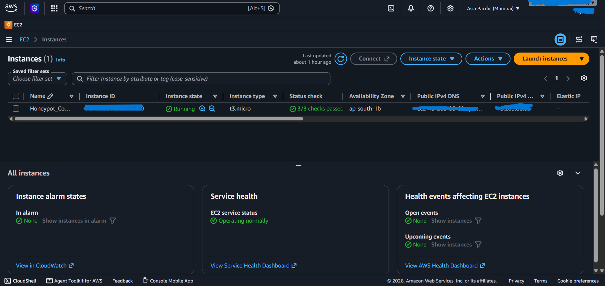
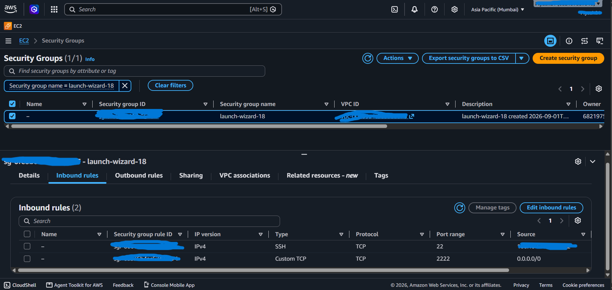
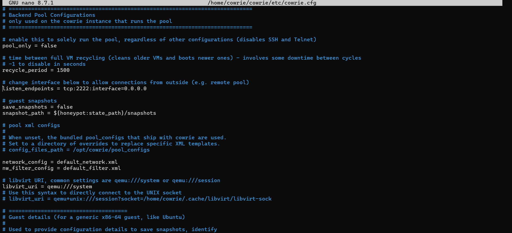
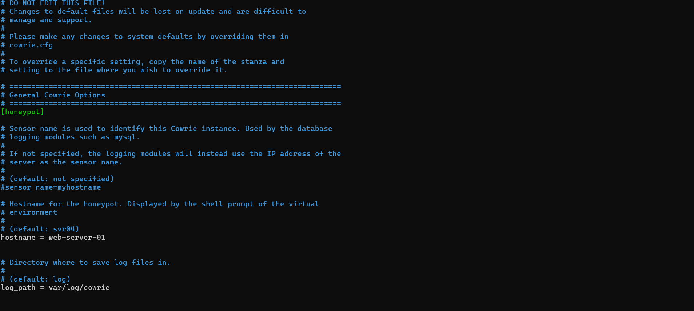
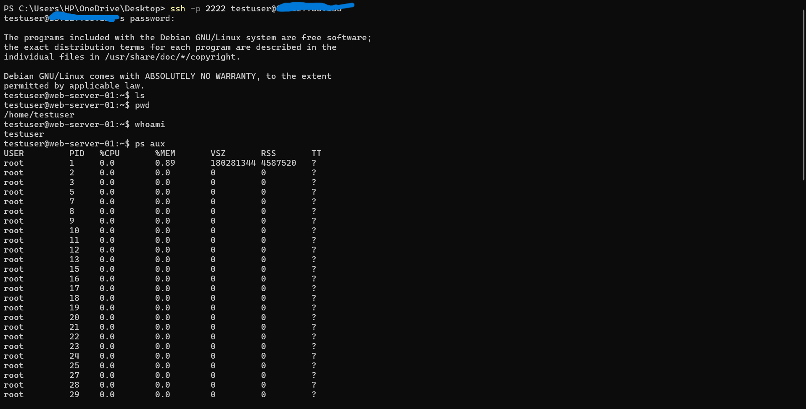
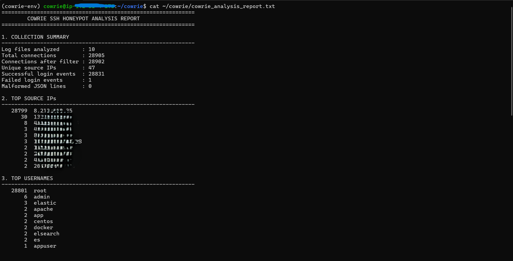
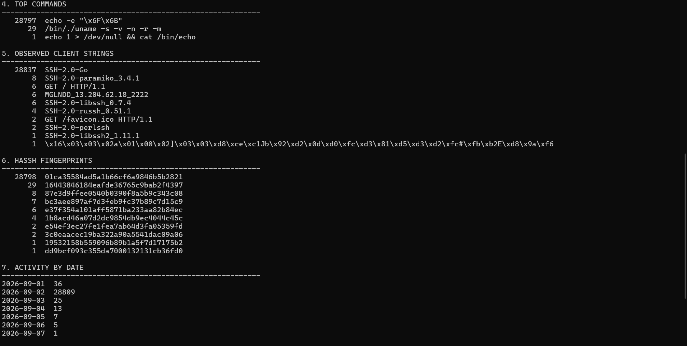
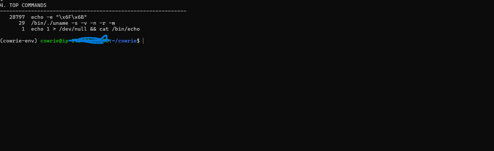
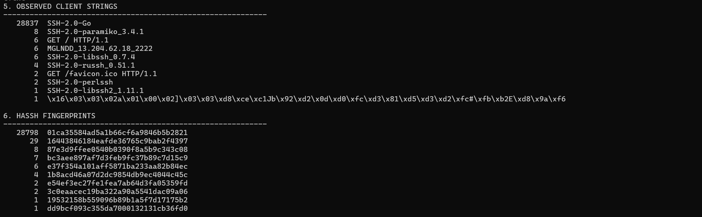
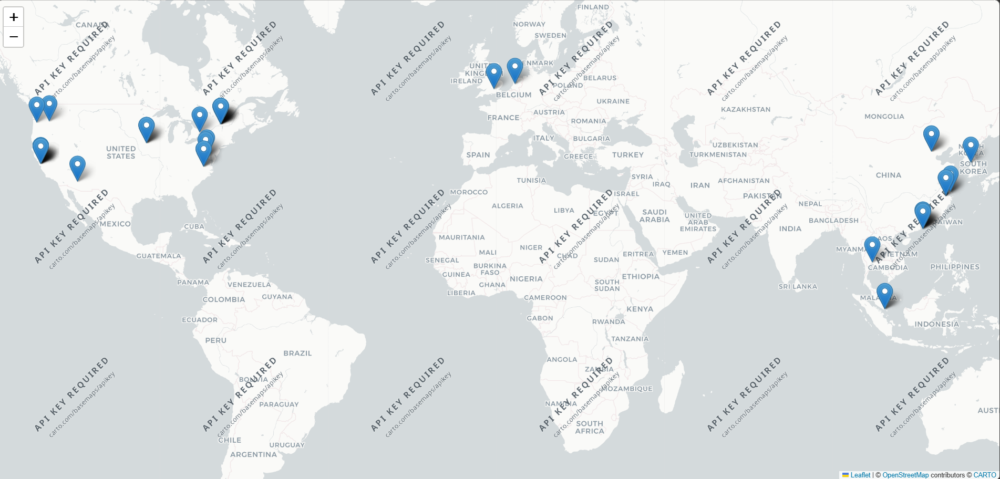

# AWS Cowrie Honeypot – SSH Attack Monitoring System

A cloud-based SSH honeypot deployed on AWS EC2 to capture, analyze, and visualize SSH connection activity using Cowrie and Python.

---

## Project Overview

This project deploys a **Cowrie SSH honeypot** on an Ubuntu Linux server hosted on AWS EC2.

The honeypot exposes a controlled SSH service that records connection attempts, authentication activity, commands, SSH client information, and HASSH fingerprints.

The collected JSON logs are analyzed using Python to identify repeated activity patterns and other characteristics of the observed SSH traffic.

The project also includes GeoIP-based visualization of observed source locations.

> **Important:** Cowrie is an emulated environment. Successful authentication recorded by Cowrie does not mean that the AWS EC2 host was compromised.

---

## Architecture

```text
Windows Test Machine
        |
        | SSH
        v
AWS EC2 Ubuntu Server
        |
        v
Cowrie SSH Honeypot
        |
        v
Cowrie JSON Logs
        |
        v
Python Log Analysis
        |
        +------------------+
        |                  |
        v                  v
Security Findings      GeoIP Mapping
```

### Network Configuration

| Service | Port | Purpose |
|---|---:|---|
| SSH | 22 | Administrative access |
| Cowrie | 2222 | Honeypot SSH service |

Port **22** was restricted for administrative access, while port **2222** was exposed for the Cowrie honeypot.

---

## Technologies Used

- AWS EC2
- Ubuntu Linux
- Cowrie SSH Honeypot
- Python
- JSON
- Folium
- GeoIP
- SSH
- Git
- GitHub

---

## Features

- AWS EC2-based honeypot deployment
- SSH activity collection using Cowrie
- Authentication event monitoring
- Username analysis
- Command analysis
- Source IP analysis
- SSH client identification
- HASSH fingerprint analysis
- Activity-by-date analysis
- GeoIP visualization
- Python-based automated log analysis
- Separation of administrative SSH and honeypot SSH

---

## Data Collection

Cowrie records security events in JSON format.

The analysis focuses on the following event types:

| Event | Purpose |
|---|---|
| `cowrie.session.connect` | Records incoming connections |
| `cowrie.login.success` | Records authentication accepted by Cowrie |
| `cowrie.login.failed` | Records failed authentication attempts |
| `cowrie.command.input` | Records commands entered into the honeypot |
| `cowrie.client.version` | Records client-reported SSH information |

The project-owner test IP addresses were excluded from the final external-activity analysis.

---

## Analysis Results

The collected Cowrie logs were analyzed using a Python script.

| Metric | Result |
|---|---:|
| Log files analyzed | 10 |
| Total connections | 28,905 |
| Connections after filtering | 28,902 |
| Unique source IPs | 47 |
| Successful login events | 28,831 |
| Failed login events | 1 |
| Malformed JSON lines | 0 |
| Most frequent command | `echo -e "\x6F\x6B"` |
| Most frequent command count | 28,797 |
| Most observed client | `SSH-2.0-Go` |
| Most observed client count | 28,837 |
| Dominant HASSH fingerprint count | 28,798 |

---

## Observed Activity

The analysis showed highly repetitive SSH connection activity.

The highest-activity source generated **28,799 connections**.

The most frequently attempted username was:

`root`

The most frequently observed command was:

`echo -e "\x6F\x6B"`

This command appeared **28,797 times**.

The highly repetitive connection and command patterns indicate automated or scripted activity.

---

## Command Analysis

The most frequently observed command was **`echo -e "\x6F\x6B"`** with **28,797 occurrences**.

| Command | Count |
|---|---:|
| `echo -e "\x6F\x6B"` | 28,797 |
| `/bin/./uname -s -v -n -r -m` | 29 |
| `echo 1 > /dev/null && cat /bin/echo` | 1 |

The repeated `uname` command represents system-information discovery within the emulated environment.

The highly repetitive command pattern indicates automated or scripted activity.

---

## Username Analysis

The most frequently observed usernames were:

| Username | Count |
|---|---:|
| `root` | 28,801 |
| `admin` | 6 |
| `elastic` | 3 |
| `apache` | 2 |
| `app` | 2 |
| `centos` | 2 |
| `docker` | 2 |
| `elsearch` | 2 |
| `es` | 2 |
| `appuser` | 1 |

The large number of `root` authentication attempts demonstrates that privileged account names were heavily targeted.

---

## Observed Client and Protocol Strings

Cowrie recorded several client and protocol identification strings.

| Client / Protocol String | Count |
|---|---:|
| `SSH-2.0-Go` | 28,837 |
| `SSH-2.0-paramiko_3.4.1` | 8 |
| `GET / HTTP/1.1` | 6 |
| `MGLNDD_13.204.62.18_2222` | 6 |
| `SSH-2.0-libssh_0.7.4` | 6 |
| `SSH-2.0-russh_0.51.1` | 4 |
| `GET /favicon.ico HTTP/1.1` | 2 |
| `SSH-2.0-perlssh` | 2 |
| `SSH-2.0-libssh2_1.11.1` | 1 |

The `SSH-2.0-Go` client string was the dominant observed client identifier.

These strings describe client-reported protocol information and do not independently identify a specific attacker.

---

## HASSH Analysis

HASSH fingerprints were used to group SSH connections according to their SSH handshake characteristics.

| HASSH Fingerprint | Count |
|---|---:|
| `01ca35584ad5a1b66cf6a9846b5b2821` | 28,798 |
| `16443846184eafde36765c9bab2f4397` | 29 |
| `87e3d9ffee0540b0390f8a5b9c343c08` | 8 |
| `bc3aee897af7d3feb9fc37b89c7d15c9` | 7 |
| `e37f354a101aff5871ba233aa82b84ec` | 6 |
| `1b8acd46a07d2dc9854db9ec4044c45c` | 4 |
| `e54ef3ec27fe1fea7ab64d3fa05359fd` | 2 |
| `3c0eaacec19ba322a90a5541dac09a06` | 2 |
| Other fingerprints | 2 |

The dominant fingerprint appeared in **28,798 connections**, showing a highly repetitive SSH connection pattern.

HASSH grouping can indicate similar SSH client behavior, but it should not be treated as proof that all connections came from the same attacker.

---

## Activity by Date

| Date | Connections |
|---|---:|
| 2026-09-01 | 36 |
| 2026-09-02 | 28,809 |
| 2026-09-03 | 25 |
| 2026-09-04 | 13 |
| 2026-09-05 | 7 |
| 2026-09-06 | 5 |
| 2026-09-07 | 1 |
| 2026-09-16 | 3 |
| 2026-09-17 | 1 |
| 2026-09-22 | 2 |

The highest observed connection activity occurred on **2026-09-02**, with **28,809 connections**.

---

## GeoIP Visualization

The project includes a GeoIP visualization of observed source locations.

The map is generated using Python and Folium.

GeoIP information is approximate and is used only for visualization and analysis.

No raw source IP data is included in the public repository beyond the summarized analysis results.

---

## Manual SSH Test

A controlled SSH connection was performed against the Cowrie listener to verify that the honeypot accepted connections and recorded shell activity.

Example test commands included:

```text
whoami
ls
pwd
ps aux
exit
```

The commands were captured by Cowrie and subsequently processed by the Python analysis script.

---

## Python Analysis

The project includes a lightweight Python analysis script:

```text
scripts/analyze_cowrie.py
```

The script processes Cowrie JSON logs and generates a summary report containing:

- Connection statistics
- Source IP activity
- Username activity
- Commands
- SSH client strings
- HASSH fingerprints
- Activity by date
- Key observations

The generated report is saved locally and is not included in the public repository.

---

## Project Screenshots

### AWS EC2 Deployment



### EC2 Security Group Configuration



### Cowrie Configuration — Listen Endpoint



### Cowrie Configuration — Hostname



### SSH Honeypot Testing



### Final Analysis — Summary



### Final Analysis — Details



### Command Analysis



### Client and HASSH Analysis



### GeoIP Visualization



---

## Repository Structure

```text
aws-cowrie-honeypot/
│
├── README.md
├── .gitignore
│
├── analysis/
│   └── results.md
│
├── docs/
│   ├── 01-aws-ec2-setup.md
│   ├── 02-linux-setup.md
│   ├── 03-cowrie-installation.md
│   ├── 04-cowrie-configuration.md
│   ├── 05-testing.md
│   ├── 06-log-analysis.md
│   └── 07-challenges.md
│
├── screenshots/
│   ├── 01-ec2-instance.png
│   ├── 02-cowrie-configuration1.png
│   ├── 02-cowrie-configuration2.png
│   ├── 03-ssh-honeypot-test.png
│   ├── 04-cowrie-honeypot-report.png
│   ├── 05-geoip-map.png
│   ├── 06-command-analysis.png
│   ├── 07-command-capture.png
│   └── 08-ssh-client-analysis.png
│
└── scripts/
    ├── analyze_cowrie.py
    └── cowrie_map.py
```

---

## Documentation

Detailed setup and implementation steps are available in the `docs/` directory.

| Document | Description |
|---|---|
| [AWS EC2 Setup](docs/01-aws-ec2-setup.md) | EC2 instance creation and network configuration |
| [Linux Setup](docs/02-linux-setup.md) | Ubuntu and user configuration |
| [Cowrie Installation](docs/03-cowrie-installation.md) | Cowrie installation and environment setup |
| [Cowrie Configuration](docs/04-cowrie-configuration.md) | Honeypot configuration and listener setup |
| [Testing](docs/05-testing.md) | Controlled SSH testing |
| [Log Analysis](docs/06-log-analysis.md) | JSON log analysis and reporting |
| [Challenges](docs/07-challenges.md) | Problems encountered and solutions |

Detailed analysis results are available in:

[analysis/results.md](analysis/results.md)

---

## Challenges and Lessons Learned

### 1. Separating Administrative SSH and Honeypot SSH

Port 22 was used for secure administrative access while port 2222 was used by Cowrie.

This separation allowed the EC2 instance to remain manageable without exposing the administrative SSH service as the honeypot.

### 2. AWS Security Group Configuration

The Security Group had to be configured carefully to allow the required honeypot traffic while restricting administrative SSH access.

### 3. Running Cowrie as a Dedicated User

Cowrie was configured under a dedicated non-root Linux user rather than running the honeypot directly as root.

### 4. Log Analysis

The raw Cowrie JSON logs contained a large number of events.

A Python script was developed to process the logs and convert them into a readable security analysis report.

### 5. Filtering Manual Test Activity

Manual testing generated additional events in the logs.

Known project-owner test IP addresses were therefore excluded from the final external-activity analysis.

---

## Limitations

- A source IP address does not necessarily represent a unique attacker.
- GeoIP information is approximate.
- Client strings and HASSH fingerprints describe connection characteristics but do not independently identify an attacker.
- Cowrie provides an emulated environment rather than a real production SSH shell.
- Successful Cowrie authentication does not indicate compromise of the AWS EC2 host.
- Observed commands alone are not sufficient to identify a specific malware family or threat actor.
- The analysis represents activity observed during the project's collection period and should not be treated as a complete representation of Internet-wide SSH activity.

---

## Security and Data Privacy

The public repository intentionally does not contain:

- Raw Cowrie logs
- Passwords
- Private SSH keys
- Complete raw session data
- Sensitive AWS credentials
- Local configuration containing secrets

Only summarized analysis results and selected screenshots are included.

---

## Learning Outcomes

This project provided practical experience with:

- AWS EC2 deployment
- Ubuntu Linux administration
- SSH configuration
- Network Security
- Honeypot deployment
- Cowrie
- JSON log analysis
- Python scripting
- SSH client analysis
- HASSH fingerprinting
- GeoIP visualization
- Security monitoring
- Git and GitHub documentation

---

## Conclusion

This project demonstrates a complete workflow for deploying an SSH honeypot in a cloud environment and analyzing the resulting security telemetry.

The workflow consists of:

```text
AWS EC2
   ↓
Ubuntu Linux
   ↓
Cowrie SSH Honeypot
   ↓
JSON Security Logs
   ↓
Python Log Analysis
   ↓
Security Findings
   ↓
Visualization and Documentation
```

The project combines **cloud infrastructure, Linux, networking, cybersecurity monitoring, Python automation, and security analysis** into a single practical implementation.
